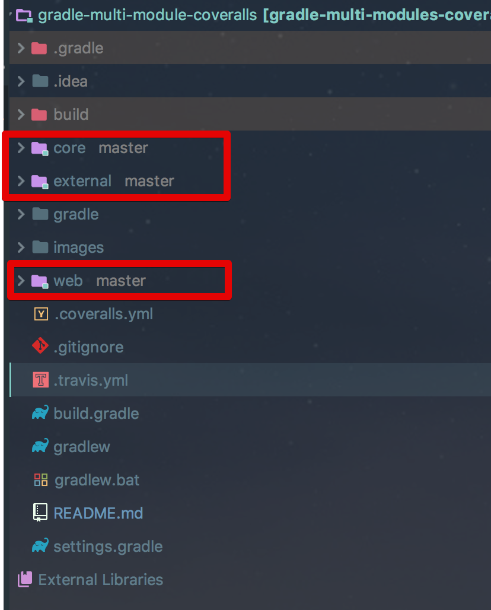
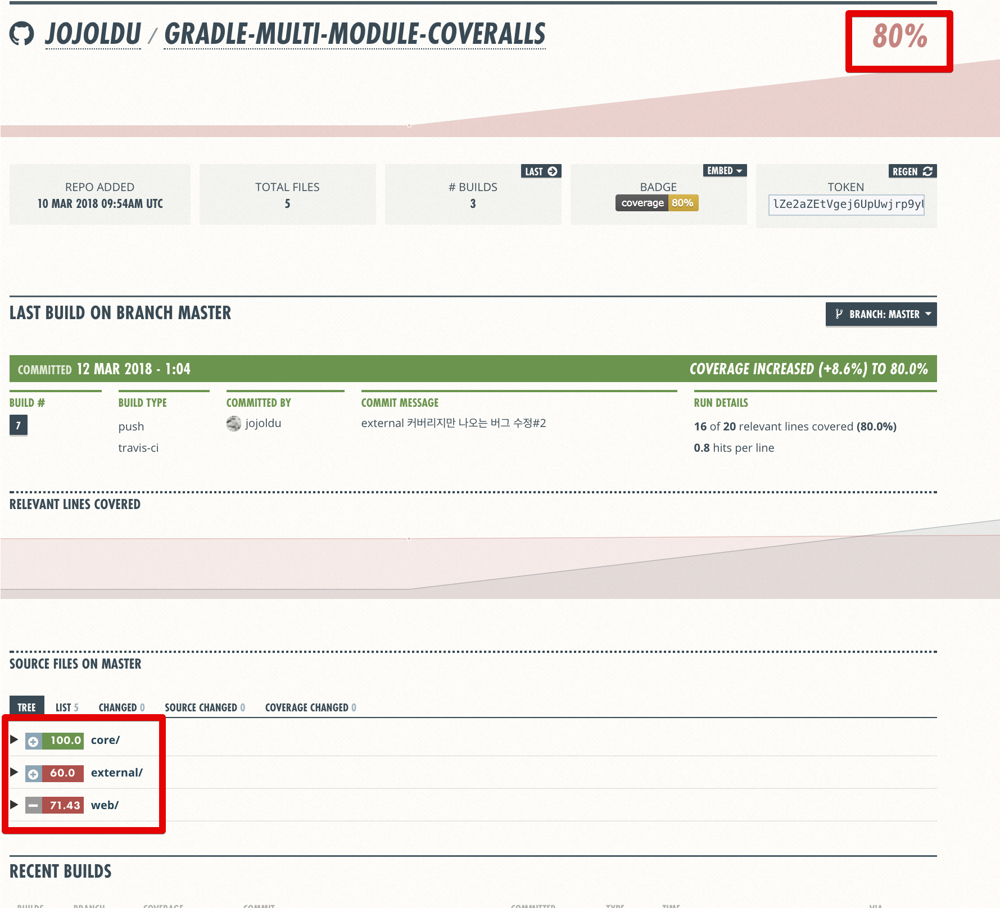

# Gradle 멀티 모듈에서 TravisCI & Coveralls 연동

[](https://travis-ci.org/jojoldu/gradle-multi-module-coveralls) [](https://coveralls.io/github/jojoldu/gradle-multi-module-coveralls?branch=master)

## 소개


기존의 [Gradle + SpringBoot + Travis CI + Coveralls + 텔레그램 연동하기](http://jojoldu.tistory.com/275)가 
일반 Gradle 프로젝트를 다루기 때문에 [Gradle Multi Module](http://jojoldu.tistory.com/123) 프로젝트에서는 Coveralls를 그대로 적용할수가 없었습니다.  
그래서 이번 시간에는 **Gradle Multi Module에서 Coveralls를 연동**하는 방법을 소개 드립니다.   
모든 코드는 [Github](https://github.com/jojoldu/gradle-multi-module-coveralls)에 있으니 참고하시면 됩니다.  

## 적용

앞서 소개드린 [일반 Gradle 프로젝트에서 Travis CI & Coveralls 연동하기](http://jojoldu.tistory.com/275)를 이미 해보셨다는 가정하에 시작합니다.  
만약 아직 진행하지 않으셨다면, **본인의 멀티모듈 프로젝트에 해당 과정을 먼저 진행**해보세요!  

> 여기서는 멀티모듈 구조를 만드는 방법은 소개하지 않습니다.  
이미 멀티모듈 구조인 프로젝트에 coveralls를 적용하는 포스팅이라고 보시면 됩니다.  
Gradle 멀티 모듈이 처음이시라면 [이전 포스팅](http://jojoldu.tistory.com/123)을 참고해보세요!
    
샘플 프로젝트의 구조는 다음과 같이 core/external/web 이라는 3개의 모듈로 구성되어있습니다.



> 일반적인 멀티모듈 구조라고 보시면 됩니다.  

컨셉은 간단합니다.  
"**서브 모듈들을 각각 JacocoReport 수행후, 이를 취합해서 Coveralls에 전송한다**"입니다.  
기존과 비교해서 변경하는 점은 ```build.grade```과 ```.coveralls.yml```두개 뿐입니다.  
  
build.gradle을 아래와 같이 변경합니다.

```yml
buildscript {
    ...
	dependencies {
	    ...
		classpath 'org.kt3k.gradle.plugin:coveralls-gradle-plugin:2.8.2'
	}
}

// 전체 프로젝트 일괄 적용
allprojects {
	apply plugin: 'com.github.kt3k.coveralls'
	apply plugin: 'jacoco'

	repositories {
		jcenter()
	}
}

// 서브모듈들 설정
subprojects {
    ...

	jacocoTestReport {
		reports {
			html.enabled = true // 개발자 확인용
			xml.enabled = true // coveralls 전송용
		}
	}
}

// 각 서브모듈들의 JacocoReport 취합
task jacocoRootReport(type: JacocoReport) {
	description = 'Generates an aggregate report from all subprojects'
	dependsOn = subprojects.test
	sourceDirectories = files(subprojects.sourceSets.main.allSource.srcDirs)
	classDirectories =  files(subprojects.sourceSets.main.output)
	executionData = files(subprojects.jacocoTestReport.executionData)
	reports {
		html.enabled = true // 개발자 확인용
		xml.enabled = true // coveralls 전송용
	}
}

// coveralls Task로 jacocoRootReport 로 취합된 결과만 전송 
coveralls {
	sourceDirs = subprojects.sourceSets.main.allSource.srcDirs.flatten()
	jacocoReportPath = "${buildDir}/reports/jacoco/jacocoRootReport/jacocoRootReport.xml"
}
```

> 코드별 설명은 주석으로 대체하겠습니다.

그리고 ```.travis.yml```에는 ```after_success:```를 다음과 같이 수정합니다.

```yml
after_success:
- ./gradlew jacocoRootReport coveralls
```

> jacocoRootReport 수행후 coveralls을 실행합니다.

이렇게 변경후 Github에 Push 해보시면!



전체 커버리지와 **각 모듈별 커버리지**가 모두 출력됩니다!  
어느 모듈의 커버리지가 낮은지, 떨어졌는지 쉽게 확인할수 있겠죠?  

